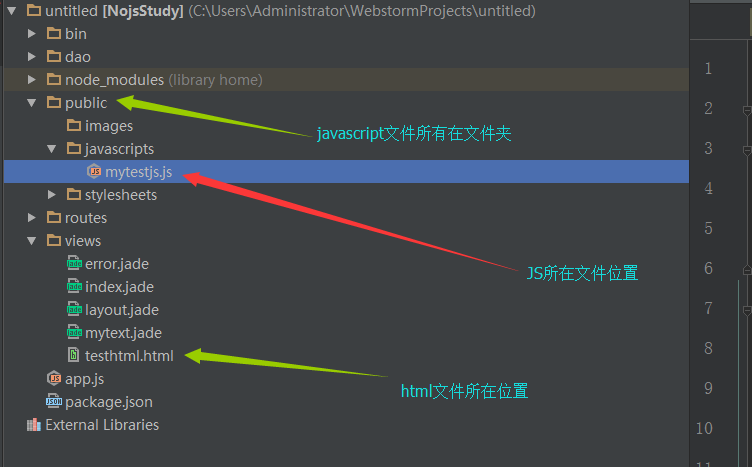

#Node.js + Express+WebStorm初学

**项目地址:[NodeJs学习](https://github.com/NanFengyang/nodejs_Study)**

## 1.添加接口路由 routes

1. 在routes目录下新建XX.js文件，内部至少添加如下方法：

``` javascript
 /**
 * 初始化基本配置,添加一个GET方法
 */
var express = require('express');
var routes = express.Router();

routes.get('/', function (req, res, next) {
    res.render('testhtml');//导入页面模版
});
module.exports = routes;

```

2. 然后在app.js配置文件下添加代码：**注意放置位置，可以参考默认配置。为了方便，下面放在一起**

``` javascript

 /**
 *app.js配置文件添加路由
 */
var xxjs=require('./routes/xxjs');
app.use('/xxjs', xxjs);

```

3. 路由文件js，添加post，put，delete等接口访问方法，直接在路由js文件下添加如下代码:


``` javascript

 /**
 * 测试接口路由
 */
var express = require('express');
var routes = express.Router();

routes.get('/', function (req, res, next) {
    res.send("GET方法");
});
routes.post('/', function (req, res, next) {
    res.send("POST方法");
});
routes.put('/', function (req, res, next) {
    res.send("PUT方法");
});
routes.delete('/', function (req, res, next) {
    res.send("delete方法");
});
module.exports = routes;//模块使用，添加到路径

```

## 2.改变默认页面引擎,使用html页面

1. 添加html的ejs引擎。在项目目录下,使用node.js输入如下指令；使用WebStorm的话，在IDE下放的Terminal窗口输入指令：

```
npm install ejs -save

```

之后会自动安装，安装成功如下：

```

C:\Users\Administrator\WebstormProjects\untitled>npm install ejs -save
ejs@2.5.2 node_modules\ejs

```

2. 配置文件修改。打开app.js，添加修改如下代码:

``` javascript

 var ejs = require('ejs');//导入添加模版
 
 //app.set('view engine', 'jade');//默认页面模版,注释掉
 //使用新的引擎 要在该目录下运行指令，npm install ejs -save。
 app.engine('.html', ejs.__express);//引擎切换
 app.set('view engine', 'html');//页面模版
 
```

3. 添加新html页面。在**views**目录下，新建**test.html**文件

``` javascript

<!DOCTYPE html>
<html lang="en">
<head>
    <meta charset="UTF-8">
    <title>testHtmle测试</title>
</head>
<body>

</body>
</html>

```

4. 在路由js文件接口下，使用新的**test.html**文件。

``` javascript

  routes.get('/', function (req, res, next) {
    res.render('test');
});

```

5. 运行项目。修改页面成功。


## 3. html调用页面javascript的路径问题 



``` javascript

/**
 *JS文件调用代码
 */
<script src="./javascripts/mytestjs.js" ></script>

```


## 4. 图片资源引用,文件布局同上文js引用

``` 

/**
 *引用相对地址
 */


```

## 5.js对象

```
var user = {
    username: "南风",
    userage: 25,
    userimgpath: "./images/img1.png",
    userborth: "2003/11/22"
};

```


